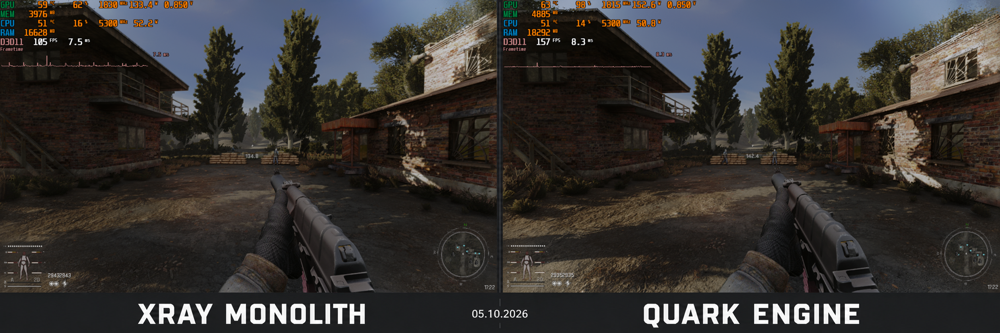

<p align="center">
  
</p>

<p align="center">
  
</p>

<p align="center">
  <b>English</b> · <a href="README.ru.md">Русский</a>
</p>

<p align="center">
  
  
  
  <a href="https://discord.com/invite/X7GRYsNNEc"></a>
</p>

<p align="center">
  <b>The engine's goal is to optimize the use of modern hardware to improve performance and address numerous technical issues, while maintaining compatibility with mods and modpacks.</b>
</p>

<p align="center">
  <a href="https://github.com/quark-engine-stalker/quark-engine-stalker/releases">Download / Releases</a> ·
  <a href="#engine-installation-and-requirements">Installation</a> ·
  <a href="CHANGELOG.md">Changelog</a> ·
  <a href="#documentation">Documentation</a> ·
  <a href="https://discord.com/invite/X7GRYsNNEc">Discord</a>
</p>

---

## Support and Changelog

The engine is tested with **STALKER: Anomaly 1.5.3** and **STALKER: GAMMA 0.9.5**.  
Update history: [CHANGELOG.md](CHANGELOG.md).

## Engine Installation and Requirements

**Technical requirements:** your CPU must support **AVX2**. Also install or update the [Microsoft Visual C++ Redistributable x64](https://aka.ms/vs/17/release/vc_redist.x64.exe).

1. Make sure **STALKER: Anomaly 1.5.3** and **STALKER: GAMMA 0.9.5** are installed correctly. Refer to their official installation instructions.
2. Back up the engine files that will be replaced in **`Anomaly\\bin\\`**.
3. Download `AnomalyDX11AVX.exe` and `AnomalyDX11AVX.pdb`, then place them into **`Anomaly\\bin\\`** and confirm file replacement when prompted.
4. Launch the game through **MO2 (Mod Organizer)**. Installation and launch examples are shown below.
5. Compatibility with existing save files is not guaranteed. Starting a new game is recommended.
6. If you encounter errors or crashes, send us the logs from **`AppData\\Roaming\\QUARK ENGINE\\ERROR\\`** via Discord. These files help identify the cause of the issue and further improve the engine.

<p align="center">
  
  
</p>

## Source Code and Building

```text
quark-engine-stalker/
├── src/                 # Main engine source code
│   ├── 3rd party/       # Third-party libraries and their source code
│   └── QUARK ENGINE.sln
├── sdk/                 # Headers, codec sources, and libraries used for linking
├── docs/assets/         # README assets and installation illustrations
├── licenses/            # License texts for dependencies
├── CHANGELOG.md         # Version history in English
├── CHANGELOG.ru.md      # Version history in Russian
└── License.txt          # X-Ray distribution terms
```

The primary build configuration is **`DX11-AVX | x64`**. For details and the MSBuild command, see the [build guide](BUILDING.md).

## Documentation

| Document | English | Русский |
| :--- | :--- | :--- |
| Project overview and installation | [README](README.md) | [README](README.ru.md) |
| Building from source | [Building](BUILDING.md) | [Сборка](BUILDING.ru.md) |
| Version history | [Changelog](CHANGELOG.md) | [История изменений](CHANGELOG.ru.md) |
| Code origins and third-party components | [Third-party components](THIRD_PARTY.md) | [Сторонние компоненты](THIRD_PARTY.ru.md) |
| Release description template | [Release template](docs/release-template.md) | [Шаблон релиза](docs/release-template.ru.md) |

## Community and Project Authors

Join us: **[QUARK ENGINE DISCORD](https://discord.com/invite/X7GRYsNNEc)**.  
QUARK ENGINE is based on [X-Ray Monolith](https://github.com/themrdemonized/xray-monolith).

## License

The original X-Ray Engine used by S.T.A.L.K.E.R. belongs to **GSC Game World**. Distribution terms: [License.txt](License.txt).
