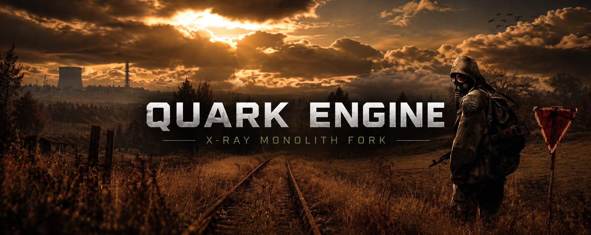
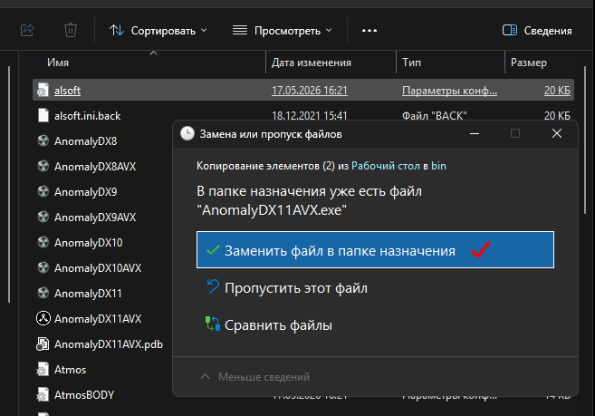
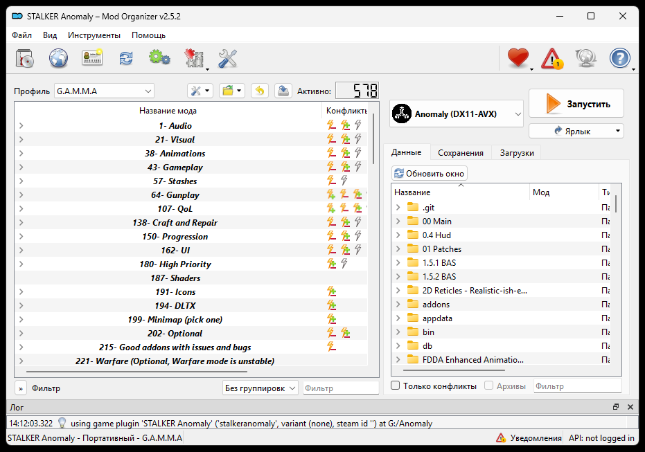

<p align="center">
  
</p>

<p align="center">
  <a href="README.md">English</a> · <b>Русский</b>
</p>

<p align="center">
  
  
  
  <a href="https://discord.com/invite/X7GRYsNNEc"></a>
</p>

<p align="center">
  <b>Quark Engine — форк X-Ray Monolith. Его цель — эффективнее использовать современное железо, повышать производительность и устранять технические проблемы, сохраняя совместимость с модами и сборками.</b>
</p>

<p align="center">
  <a href="https://github.com/quark-engine-stalker/quark-engine-stalker/releases">Скачать / Releases</a> ·
  <a href="#установка-движка-и-технические-требования">Установка</a> ·
  <a href="CHANGELOG.ru.md">История изменений</a> ·
  <a href="#документация">Документация</a> ·
  <a href="https://discord.com/invite/X7GRYsNNEc">Discord</a>
</p>

---

## Поддержка и список изменений

Готовые сборки движка и файлы отладки: **[GitHub Releases](https://github.com/quark-engine-stalker/quark-engine-stalker/releases)**. Выберите нужную версию и скачайте `.exe` и `.pdb` из раздела **Assets**. Файлы появляются в Assets после загрузки автором сборки.

Движок тестируется на **STALKER: Anomaly 1.5.3** и **STALKER: GAMMA 0.9.5**.
История обновлений: [CHANGELOG.ru.md](CHANGELOG.ru.md).

## Установка движка и технические требования

**Технические требования:** процессор с поддержкой **AVX2** и установленные библиотеки [Microsoft Visual C++ Redistributable x64](https://aka.ms/vs/17/release/vc_redist.x64.exe).

1. Убедитесь, что **STALKER: Anomaly 1.5.3** и **STALKER: GAMMA 0.9.5** установлены корректно. Инструкции по установке ищите у их авторов.
2. Сохраните резервную копию заменяемых файлов движка из **`Anomaly\bin`**.
3. Скопируйте `AnomalyDX11AVX.exe` и соответствующий ему `AnomalyDX11AVX.pdb` в **`Anomaly\bin`** и выберите **«Заменить в папке назначения»**.
4. Запустите игру через **MO2 (Mod Organizer)**. Примеры установки и запуска представлены ниже.
5. Совместимость с текущими сохранениями не гарантируется, рекомендуется начать новую игру.
6. При возникновении ошибок или вылетов отправьте нам через Discord логи из **`AppData\Roaming\QUARK ENGINE\ERROR`**. Эти файлы помогают установить причину сбоя.

<p align="center">
  
  
</p>

## Исходники и сборка

```text
quark-engine-stalker/
├── src/                 # Основной код движка
│   ├── 3rd party/       # Сторонние библиотеки и их исходники
│   └── QUARK ENGINE.sln
├── sdk/                 # Заголовки, исходники кодеков, библиотеки для линковки
├── docs/assets/         # Оформление README и иллюстрация установки
├── licenses/            # Лицензионные тексты зависимостей
├── CHANGELOG.md         # История версий на английском
├── CHANGELOG.ru.md      # История версий на русском
└── License.txt          # Условия распространения X-Ray
```

Основная конфигурация: **`DX11-AVX | x64`**. Подробности и команда MSBuild в [руководстве по сборке](BUILDING.ru.md).

## Документация

Каждый документ доступен на английском и русском. Для выбора языка используйте переключатель в начале страницы.

| Документ | English | Русский |
| :--- | :--- | :--- |
| Обзор проекта и установка | [README](README.md) | [README](README.ru.md) |
| Сборка из исходников | [Building](BUILDING.md) | [Сборка](BUILDING.ru.md) |
| История версий | [Changelog](CHANGELOG.md) | [История изменений](CHANGELOG.ru.md) |
| Происхождение кода и сторонние компоненты | [Third-party components](THIRD_PARTY.md) | [Сторонние компоненты](THIRD_PARTY.ru.md) |
| Шаблон описания релиза | [Release template](docs/release-template.md) | [Шаблон релиза](docs/release-template.ru.md) |

## Сообщество и авторы проекта

Присоединяйтесь к **[DISCORD QUARK ENGINE](https://discord.com/invite/X7GRYsNNEc)**.

Quark Engine основан на [X-Ray Monolith](https://github.com/themrdemonized/xray-monolith). Происхождение кода и сведения о сторонних компонентах описаны в [THIRD_PARTY.ru.md](THIRD_PARTY.ru.md).

## Лицензия

Оригинальный X-Ray Engine игры S.T.A.L.K.E.R. принадлежит **GSC Game World**. Условия распространения: [License.txt](License.txt).
